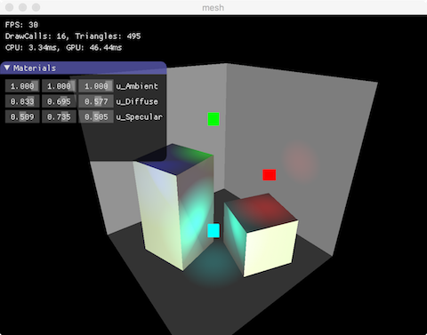

# What is This?
[](https://travis-ci.org/shawnscode/crayon)
[](https://codecov.io/gh/shawnscode/crayon)
[](https://docs.rs/crayon)
[](https://crates.io/crates/crayon)
[](https://github.com/shawnscode/crayon/blob/master/LICENSE-APACHE)

Crayon is a small, portable and extensible game framework written in Rust. It is written with a minimalistic modular design philosophy, and built from the ground up to focus on cache friendly data layouts in multicore environments.

It is loosely inspired by some amazing blogs on [bitsquid](https://bitsquid.blogspot.de) and [molecular](https://blog.molecular-matters.com). Some goals include:

- Extensible through external code modules;
- Run on macOS, Linux, Windows, iOS, Android from the same source;
- Stateless, layered, multithread render system with OpenGL(ES) 3.0 backends;
- Entity component system with a data-driven designs;
- Unified interface for handling input devices across platforms;
- Asynchronous data loading from various filesystem;
- etc.

This project adheres to [Semantic Versioning](http://semver.org/), all notable changes will be documented in this [file](./CHANGELOG.md).

### Quick Example
For the sake of brevity, you can also run a simple and quick example with commands:

``` sh
git clone git@github.com:shawnscode/crayon.git && cd crayon/crayon-examples
cargo run mesh
```

### Examples and Screenshots

Check out [here](./crayon-examples) for details.

