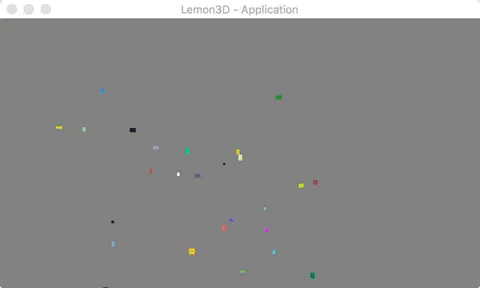

### Build Status
[](https://travis-ci.org/kaisc/crayon)
[](https://crates.io/crates/crayon)

### Introduction
Crayon is an experimental purpose project, written with a minimalistic modular design philosophy. Its built from the ground up to focus on cache friendly data layouts in multicore environments with entity-component based architecture.

*Warning*: Its far from a stable version right now. You can checkout the [Roadmap](https://trello.com/b/vDqw6L0x/crayon-roadmap) for more details.

### Features v0.0.1
- [x] \[ECS\] Entity component system with a data-driven designs.
- [x] \[TSK\] Task based multi-thread system based on awesome crate [Rayon](https://github.com/nikomatsakis/rayon.git).
- [x] \[RES\] Abstract archive with default supports for native filesystem and zip.
- [x] \[RES\] Resource management based on Referece-Count and LRU cache strategy.
- [x] \[GFX\] Window and graphic context management based on [glutin](https://github.com/tomaka/glutin).
- [x] \[GFX\] Stateless, layed, multithread `Graphics` subsystem with OpenGL(ES) 2.0+ backends.
- [x] \[SCE\] Hierachy-based transformation of position/rotaion/scale etc.
- [x] \[SCE\] Automatic-bath based `Sprite` that support easy and quick way to draw 2d images.

### FAQ

##### How to Build?
In spite of the unstable status of this project, feel free to checkout and build to follow progress recently.

First of all, checkout the repository by:
``` sh
git clone git@github.com:kaisc/crayon.git
```

And then you can run test cases with:
``` sh
cargo run --manifest-path crayon-runtime/Cargo.toml --example render_target
```

<p align="center">
  
</p>

##### Why Rust ?

First of all, this is a part-time toy project of myself,  so i don't really care if we ever have a game engine written in Rust.

And the most importantly, it makes sense for me to take the numerous advantages of modern programming language, instead of using languages like C/C++ which have many historical burden. In fact, this project has beed development with C++ for about four months, which produce a basic multi-thread, and much more pains.
